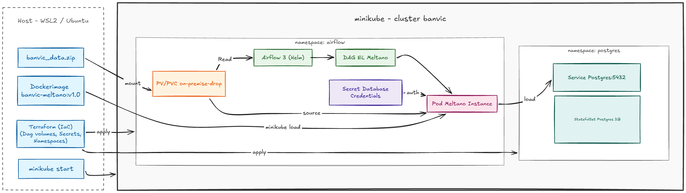

# Pipeline de ingestão BanVic (Airflow + Meltano + PostgreSQL)

POC de infraestrutura e pipeline de dados para o Banco Vitória (BanVic). Um dump diário
do ERP on-premises (um `.zip` com 7 CSVs) é depositado numa *drop zone*, detectado pelo
Airflow via `FileSensor` e carregado no PostgreSQL de destino pelo Meltano (EL puro,
camada `raw`). Tudo roda num Kubernetes local (**minikube**) provisionado por
**Terraform**.

## Arquitetura

<p align="center">
  
</p>

- **Drop zone**: pasta host `banvic_data/` → path do nó `/mnt/on_premise_drop` (via
  `minikube mount`) → PV/PVC `on-premise-drop`, montado nos pods do Airflow em
  `/opt/airflow/data/on_premise_drop`. Dumps processados ficam retidos em `archive/`.
- **Orquestração**: Airflow 3.x (chart `apache-airflow/airflow`), DAGs entregues como
  `ConfigMap` pelo Terraform (rollout automático via checksum quando o código muda).
- **Ingestão**: a task `run_meltano` lança um pod efêmero (`KubernetesPodOperator`) que
  roda `meltano run tap-csv target-postgres`; só a pasta de CSVs do dia é montada
  read-only em `/project/data/csvs`.
- **Destino**: PostgreSQL 16 dedicado (namespace `postgres`, DB `banvic_dw`, schema
  `raw`), separado do metadata DB do Airflow. Credenciais só via `Secret`.

## Pré-requisitos

- Docker
- `minikube`
- `kubectl`
- `terraform`
- `psql` (opcional, só para conferir os dados)

> Ambiente de referência: WSL2 (Ubuntu) no Windows.

## Passo a passo

### 1. Subir o cluster

```bash
minikube start --driver=docker -p banvic
```

### 2. Buildar e carregar a imagem do Meltano

O Terraform **não** builda imagens.

```bash
docker build -t banvic-meltano:v1.0 -f meltano/dockerfile meltano/
minikube image load banvic-meltano:v1.0 -p banvic
```

### 3. Preencher os segredos do Terraform

```bash
cp terraform/secrets.auto.tfvars.example terraform/secrets.auto.tfvars
# Edite terraform/secrets.auto.tfvars e defina:
#   postgres_password, airflow_admin_password, airflow_fernet_key
# Fernet key:
python3 -c "from cryptography.fernet import Fernet; print(Fernet.generate_key().decode())"
```

`terraform/secrets.auto.tfvars` é gitignored.

### 4. Provisionar a infraestrutura

```bash
cd terraform && terraform init && terraform apply
```

Sobe: namespace `postgres` (StatefulSet `postgres:16`, DB `banvic_dw`), namespace
`airflow` (chart Helm, `LocalExecutor`), o `Secret meltano-postgres-credentials`, o
PV/PVC `on-premise-drop` e o `ConfigMap` das DAGs.

### 5. Mount da drop zone + port-forwards (um comando, mesmo terminal)

```bash
# Sobe os 3 processos em foreground no mesmo terminal. Ctrl+C derruba todos juntos.
( trap 'kill 0' EXIT
  minikube mount "$(git rev-parse --show-toplevel)/banvic_data:/mnt/on_premise_drop" -p banvic --uid 50000 --gid 0 &
  kubectl --context banvic -n postgres port-forward svc/postgres 5432:5432 &
  kubectl --context banvic -n airflow port-forward svc/airflow-api-server 8080:8080 &
  wait )
```

O subshell com `trap 'kill 0' EXIT` garante que o `Ctrl+C` mata o mount e os dois
port-forwards ao mesmo tempo; o `wait` mantém o terminal preso aos 3. O `--uid 50000`
é necessário porque o scheduler do Airflow roda como UID 50000 e precisa escrever na
drop zone.

Se preferir 3 terminais separados:

```bash
minikube mount "$(git rev-parse --show-toplevel)/banvic_data:/mnt/on_premise_drop" -p banvic --uid 50000 --gid 0
kubectl --context banvic -n postgres port-forward svc/postgres 5432:5432
kubectl --context banvic -n airflow port-forward svc/airflow-api-server 8080:8080
```

Acessos:

- **Airflow UI**: http://localhost:8080 — login `admin` / `airflow_admin_password`.
- **PostgreSQL destino**: `psql -h localhost -p 5432 -U banvic -d banvic_dw`
  (senha = `postgres_password`).

### 6. Rodar o pipeline

Deposite o dump do dia na drop zone, nomeado pela data (UTC):

```bash
cp "banvic_data/Dados Banvic.zip" "banvic_data/banvic_data_$(date +%F).zip"
```

Na UI do Airflow, despause e dispare a DAG **`banvic_meltano_extract_load`** (logical
date = hoje). A DAG executa, em cadeia:

1. `wait_for_zip` — `FileSensor` (modo `reschedule`) aguarda o `.zip` do dia (timeout 10 min).
2. `claim_zip` — move o dump para `archive/banvic_data_<ds>.zip` (retenção permanente).
3. `unzip_and_check` — extrai os CSVs em `archive/<ds>_csvs/` e exige as 7 entidades.
4. `run_meltano_tap_csv_target_postgres` — pod efêmero roda `meltano run tap-csv target-postgres`.
5. `delete_extracted_csvs` — remove só os CSVs extraídos do dia; o `.zip` permanece.

### 7. Conferir os dados

```bash
psql -h localhost -p 5432 -U banvic -d banvic_dw -c "\dt raw.*"
psql -h localhost -p 5432 -U banvic -d banvic_dw -c "select count(*) from raw.transacoes;"
# ~71999 linhas
```

## Estratégia de ingestão

**EL puro, sem transformação.** O pipeline Meltano (`meltano/meltano.yml`) é
`tap-csv` (meltanolabs) → `target-postgres` (meltanolabs), gravando as tabelas na
camada `raw` do `banvic_dw` exatamente como vêm do CSV. Modelagem/limpeza (dbt) fica
para uma etapa posterior, fora do escopo desta POC.

**Carga incremental por upsert (MERGE na PK).** O `target-postgres` roda com
`load_method: upsert`, usando as chaves declaradas em `meltano/files_def.json` como
chave de merge: PK nova → `INSERT`, PK existente → `UPDATE`. Consequências:

- **Idempotência**: re-rodar a DAG com o mesmo `.zip` é um no-op — cobre `retries` e
  re-execuções manuais sem duplicar dados.
- **Incremental**: um `banvic_data_<data>.zip` novo a cada dia acumula o estado atual
  das entidades no DW, sem recriar as tabelas.

O *extract* relê o CSV inteiro a cada execução (o `tap-csv` não usa replication
key/bookmark); a incrementalidade vem inteiramente do lado do *load*.

**Integridade e resiliência.** As primary keys são declaradas por entidade no
`files_def.json`; `unzip_and_check` falha cedo (`AirflowException`) se faltar qualquer
uma das 7 entidades antes de acionar o Meltano; `FileSensor` em modo `reschedule`
libera o worker entre as verificações; `retries=2` + idempotência tornam as falhas
transitórias seguras de reexecutar.

| Entidade | Chave de merge |
|---|---|
| `agencias` | `cod_agencia` |
| `clientes` | `cod_cliente` |
| `colaborador_agencia` | `cod_colaborador` |
| `colaboradores` | `cod_colaborador` |
| `contas` | `num_conta` |
| `propostas_credito` | `cod_proposta` |
| `transacoes` | `cod_transacao` |

> Limitação conhecida: `colaborador_agencia` é uma tabela ponte, mas usa só
> `cod_colaborador` como chave (não a composta `cod_colaborador + cod_agencia`) — um
> colaborador em mais de uma agência sofreria upsert em cima de si mesmo. Ajustar
> quando a modelagem entrar.

## Segredos

Nenhuma credencial versionada. `postgres_password`, `airflow_admin_password` e
`airflow_fernet_key` vivem em `terraform/secrets.auto.tfvars` (gitignored); o Terraform
as materializa no `Secret meltano-postgres-credentials`, consumido via `env_from` pelo
pod Meltano e via `extraEnvFrom` pelo scheduler. A DAG e o `meltano.yml` só referenciam
variáveis (`${POSTGRES_*}`).
